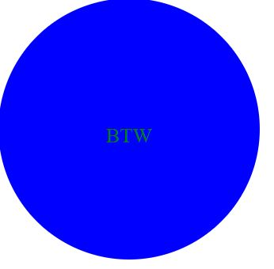
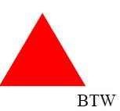

# EZ-Logo-Maker
  
  # Description
  This app is a command line application that allows a user to make simple SVG logos 
   

  # Examples and Walkthrough Demo
   
  
   
  
    
  
   
  <a href="https://youtu.be/ns3Y262kjRE"> Youtube link for Demo! </a>
  
  # Table of Contents
  - [Installation](#installation)
  - [Usage](#usage)
  - [Contributing](#contributing)
  - [Tests](#tests)
  - [Languages Used](#languages)
  - [Questions](#questions)
   

  # Installation
  See below for any of this project's dependencies - 
  Once the repo has been forked you will need to use "npm i" in your terminal to download all dependencies. This application uses FS, Inquirer, and Jest
   

  # Usage
  Once the dependencies are installed, use the command "node index.js" in the terminal and follow the steps to generate an SVG logo.
   

  # Contributing
  Brandon Whitman
   

  # Tests
  Tests were written to ensure that each shape renders correctly. To run the tests simply input "npm test" into the command line.
   

  # Languages Used
  Javascript
   

  # Questions
  Any questions can be asked at Bwhitman33@gmail.com. 
    
  The github repository for this project can be found at [Bwhitman33](https://github.com/Bwhitman33)
